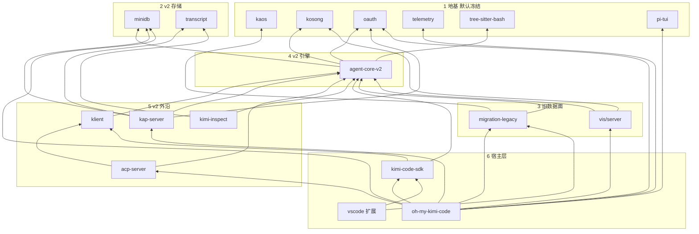

# 仓库架构图与重构切块

索引入口是 `docs/architecture/index.md`。总图在 `docs/architecture/overview.md`。

> 内部说明，不进 VitePress。依赖取自各包 `package.json` 的 workspace 声明，不是运行时调用图。
> `agent-core`、`acp-adapter`、`protocol` 三个包已删除。全仓只剩 `agent-core-v2` 一台引擎，没有引擎回退开关。

## 1. 仓库里有什么

15 个带 `package.json` 的包，外加没有包身份的目录。

| 位置 | 是什么 |
|---|---|
| `apps/kimi-code` | CLI / TUI，包名 `oh-my-kimi-code`，命令 `omkc`。只许经 SDK 用引擎，不准直依赖 `agent-core-v2` |
| `apps/kimi-inspect` | kap-server `/api/v1/debug` 的检查器 |
| `apps/kimi-web` | 只有 README。界面是 `apps/kimi-code/dist-web` 里的预构建包，源码不在本仓 |
| `apps/vis` | 会话可视化。`vis/server` 读 v2 的 wire 迁移，`vis/web` 无仓内依赖 |
| `apps/vscode` | VS Code 扩展，包名 `kimi-code`，只依赖 SDK 和 `migration-legacy` |
| `packages/*` | 引擎、存储、SDK、服务器。见下一节 |
| `plugins/` | 官方插件与 `marketplace.json` |
| `attic/cursor` | 已退役的 cursor 渠道封存，不是在役模块 |
| `docs/` | 用户文档（`en/`、`zh/`）和内部交接。用户站页面要双语；本文件不是站点页面 |
| `.agents/skills/` | 本仓开发技能（agent-core-dev、write-tui、changeset 等） |

## 2. 依赖图

箭头表示「依赖」。叶子包不依赖本仓其它包。

`apps/vis` 和 `apps/vis/web` 没有仓内依赖，图里省略。`kimi web` 永远走 kap-server。

## 3. 块，不是 15 块

按依赖切块，各自开工会在 SDK 和 CLI 上撞车。

| 块 | 包含 | 规则 |
|---|---|---|
| 1. 地基 | `kosong`、`kaos`、`oauth`、`telemetry`、`tree-sitter-bash`、`pi-tui` | 无仓内依赖。改动向上波及所有人，默认冻结 |
| 2. v2 存储 | `minidb`、`transcript` | 只被 v2、kap-server、inspect 使用 |
| 3. 旧数据面 | `migration-legacy`、`vis/server` | 已改为只依赖 v2。读旧 wire 与旧配置是本职 |
| 4. v2 引擎 | `agent-core-v2` | 三层 Scope：`App` / `Session` / `Agent`。没有 Workspace 这一层 DI。不依赖 `kaos` |
| 5. v2 外沿 | `klient`、`kap-server`、`acp-server`、`kimi-inspect` | 只坐在 v2 上 |
| 6. 宿主层 | `kimi-code-sdk`、`apps/kimi-code`、`apps/vscode` | SDK 是所有入口的公共底座，最后一个动 |

kosong 的 provider 与 v2 的 `src/kosong/provider/bases/<name>/` 是逐语义镜像。地基里的 kosong 和第四块的镜像必须一起看，不能只改一边。

## 4. 引擎现状

- 只剩一台引擎：`agent-core-v2`。`agent-core`、`acp-adapter`、`protocol` 已删除。
- CLI 的 `-p`、TUI、`doctor`、`export`、`provider` 全部走 v2。旧的 ACP 入口也已移除，`acp-server` 是唯一的 ACP。
- SDK 公开面已切到 v2：`Event` 来自 `agent-core-v2/events`，`KimiError` 类住在 SDK 自己的 `errors.ts`，wire replay 折叠用 v2 的 `foldWireRecords`。
- 事件是线形状：`AgentEvent` 联合 + `Event = AgentEvent & { agentId; sessionId }`，各成员的 `...Event` 接口定义在域名文件里。

## 5. graphify 切片

整仓约 4480 个代码文件，不能一次 graphify。本地目录 `graphify-blocks/`（已 gitignore）按上面的块做成 junction，只链各包 `src`。v2 引擎拆成两张图，因为单包源码约 900 个文件。文件数都低于 500：

| 目录 | 文件数 |
|---|---|
| `01-leaves` | 189 |
| `02-v2-store` | 82 |
| `03-legacy` | 481（删 v1 前采样） |
| `04-v2-core` | 480 |
| `04-v2-shell` | 490 |
| `05-v2-edge` | 292 |
| `06-knot` | 395（删 acp-adapter 前采样） |

`03-v1` 与 `06-knot` 的采样取自删除之前，图已不可复现；其余切片仍可按同样方式重建。不要对 `graphify-blocks/` 根目录跑。

## 6. 重构时不要假设的事

- 没有第四层 Workspace DI scope。工作区是 `IWorkspaceInstanceManager` 上的普通对象。
- `apps/kimi-web` 不是可改的源码模块。
- `attic/cursor` 是封存资产，不参与在役重构。
- 实验开关默认值未变。已发布且默认开：`subagent-model-selection`、`persistence_minidb_readmodel`、`wait_for`、`search_worker`。仍关闭：`tool-select`、`secondary-model`、`subagent_fork`、`auto_session_title`。
