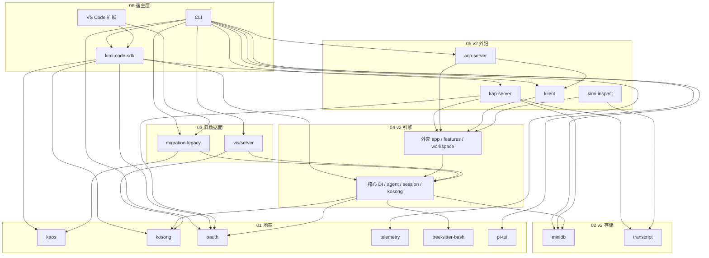

# 总架构图

索引入口是 [index.md](index.md)。切片图接在这张图上。切片内部的模块不要再画进总图。箭头是 `package.json` 里的 workspace 依赖，方向是「谁依赖谁」。

`agent-core`、`acp-adapter`、`protocol` 已删除。03 与 06 两张切片只作考古；其余描述现状。包级依赖的文字版在 `docs/architecture-map.md`。

切片正文：

- [01 地基](slices/01-leaves.md)
- [02 v2 存储](slices/02-v2-store.md)
- [03 旧数据面（原 v1，已删除引擎）](slices/03-v1.md)
- [04 v2 核心](slices/04-v2-core.md)
- [04 v2 外壳](slices/04-v2-shell.md)
- [05 v2 外沿](slices/05-v2-edge.md)
- [06 宿主层（原双引擎结，v1 已删除）](slices/06-knot.md)

接线时定下来的几条：

- v2 在总图里是一块。外壳和核心的分界只在 04 的两张切片里。外沿和 SDK 依赖的是整个 `agent-core-v2`，不是某几个服务。
- 只剩一台引擎。没有 `KIMI_CODE_LEGACY_FLAG`，也不要从官方树把 v1 抄回来。
- `kimi web` 不进这张产品结。本仓没有可改的 web 源码；预构建包在 `apps/kimi-code/dist-web`，永远走 kap-server。
- `minidb` 和 `transcript` 互不依赖。全文索引在 minidb 里，transcript 是另一套只读渲染契约。
- 地基叶子包之间没有边。kosong 的 provider 和 v2 `src/kosong` 是镜像，改地基时要同时看 04 核心，总图上不把镜像画成依赖。
