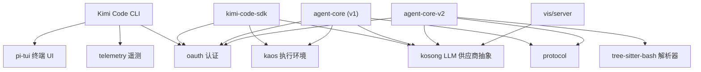

# 01 · 地基切片：叶子包

这一层是整个仓库的地基：`kosong`、`kaos`、`oauth`、`telemetry`、`tree-sitter-bash`、`pi-tui` 六个叶子包（`protocol` 已删除）彼此之间没有任何仓内依赖，报告的 Import Cycles 一节也给出 None，因此图中不存在叶子之间的横向边，所有边都由上层消费者指向叶子。报告的 God Nodes 同样落在这层——`Parser`（`tree-sitter-bash`）、`Editor` / `TuiAltScreen` / `TuiBase` / `ScrollView`（`pi-tui`）、`LocalKaos`（`kaos`）、`refreshProviderModels()`（`oauth`）——说明复杂度沉淀在叶子内部，而不是被上层摊薄；社区划分也印证了这一点，例如 Community 25 是 `kaos` 的 `chdir()` / `exec()` / `glob()`，Community 61 是 `oauth` 的 token 刷新事务。图中箭头方向统一为「消费者 → 依赖」。

## 对外

这层对外只暴露下面这些出边，除此之外不声称任何依赖关系：

- **agent-core（v1）**：`kaos`、`kosong`、`oauth`、`protocol`
- **agent-core-v2**：`kosong`、`oauth`、`protocol`、`tree-sitter-bash`
- **kimi-code-sdk**：`kaos`、`oauth`、`kosong`
- **Kimi Code CLI**：`oauth`、`telemetry`、`pi-tui`
- **vis/server**：`kosong`
