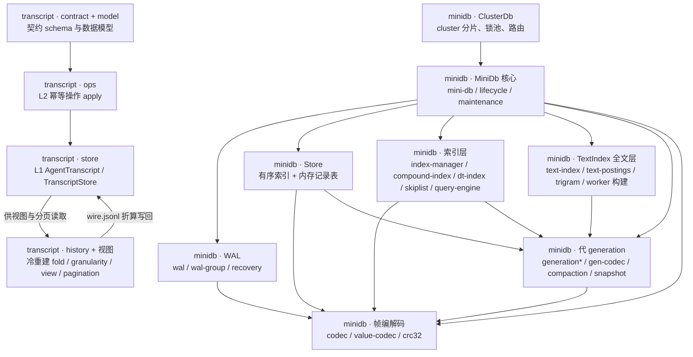

# 02 · v2 存储：`minidb` 与 `transcript`

这一块只装两个包（junction：`graphify-blocks/02-v2-store/{minidb,transcript}` → 各包 `src`，82 个源文件）：`@moonshot-ai/minidb` 是零仓内依赖的嵌入式 JSON 文档库——`snapshot + WAL` 持久化、独占写锁（抢不到锁的一方只读打开再从 WAL 追平）、大于内存的全文层与代（generation）检查点；`@moonshot-ai/transcript` 只依赖 `zod`，是同构的 transcript 渲染数据层（L1 agent 粒度 store、L2 幂等操作、L3 `off/turn/block/delta` 订阅、L4 无视架视图注册与轮次分页），并独占全部契约类型。图谱 1369 节点、3433 边、61 个社区，**Import Cycles：无**。God Nodes 前五全在 `minidb` 主干上：`MiniDb`(124)、`TextIndex`(65)、`Store`(55)、`ClusterDb`(46)、`WAL`(43)；`transcript` 侧最高的是 `AgentTranscript`(25)。Surprising Connections 暴露了几处不走中间层的直连：`codec.ts` 的 `parseFrameRefInWindow()` 直接调 `crc32()`，`dt-index.ts` 的 `DtColumn` 直接引用 `skiplist.ts` 的 `SkipList`，`server.ts` 的 `ServerHandle` 直接引用 `mini-db.ts` 的 `MiniDb`，`mini-db.ts` 直接引用 `backup.ts` 的 `BackupDeps`，`ops/operation.ts` 的 `PromptUpsertOp` 直接引用 `model/prompt.ts` 的 `TranscriptPrompt`。社区开头几个正好是功能分组：Community 0 分片锁池（`Coordinator` / `ShardLockPool` / `Router`）、Community 1 WAL 帧编码、Community 2 `transcript` 契约 schema（58 节点，全图最大）、Community 4 `ClusterDb` 与索引定义、Community 15 `TextIndex` 镜像、Community 17 transcript 的 `apply*` 折算。两包互不依赖，也都不反向依赖消费者；下图只画包内大模块，跨包边统一放在「对外」一节。

## 对外

除下列边外，本块不得新增跨包依赖：

- `agent-core-v2` → `minidb`：`packages/agent-core-v2/src/persistence/backends/minidb/miniDbQueryStore.ts`（`QueryOptions`、`ClusterDb`）。
- `kap-server` → `minidb`：`packages/kap-server/src/search/{match,indexCore,searchService}.ts` 与 `src/search/worker/*`（`@moonshot-ai/minidb/worker-runtime`）。
- `kap-server` → `transcript`：`packages/kap-server/src/services/transcript/*`、`src/transport/ws/v1/sessionEventBroadcaster.ts`、`src/search/searchService.ts`。
- `kimi-inspect` → `transcript`：`apps/kimi-inspect/src/transcript/*`、`src/audit/*`、`src/components/ChatView.tsx`。
- CLI（`apps/kimi-code`，包名 `oh-my-kimi-code`）→ `minidb`：`package.json` 声明了 `@moonshot-ai/minidb`，源码在 `src/native/smoke.ts`、`src/native/minidb-worker.ts`。
- `minidb` ↔ `transcript`：无边，两包互不依赖。
