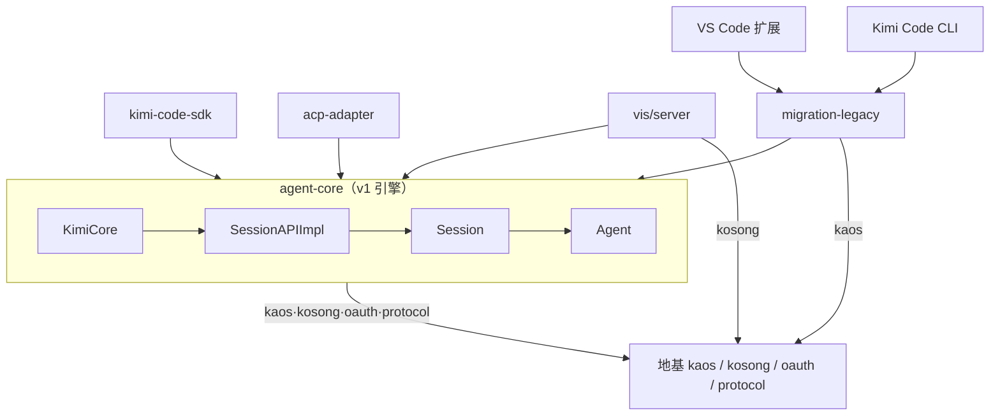

# 03 · 旧数据面（原 v1 切片，已删除引擎）

> 历史切片。`packages/agent-core` 已删除，本图描述的是删除前的结构，仅作考古参考。

删除前这一片是 v1 引擎 `agent-core`，外加两个交汇点 `migration-legacy` 与 `vis/server`；默认路径早已不走该引擎。报告的 God Nodes 全部落在 `agent-core` 内部——`Agent`（164 条边）、`KimiCore`（157）、`Session`（89）、`SessionAPIImpl`（73），其后才是 `ExecutableToolResult`、`BuiltinTool`、`BackgroundManager`、`ToolManager` 这些工具与后台执行设施；Surprising Connections 则清一色是 `vis/server` 伸进引擎的暗线：`context-projector.ts` 引用 `agent/context` 与 `agent/permission` 的类型，`wire-reader.ts` 直接调用 `agent/records/migration` 里的 `resolveWireMigrations()` / `migrateWireRecord()`——可视化服务不只画界面，还在读 v1 的 wire 记录格式。Import Cycles 全部关在 `agent-core` 内部：`agent/index.ts` 与 compaction、permission、cron、injection、session/subagent-host 之间有多组 3～4 文件的环，`rpc` 的 `client.ts` ↔ `core-api.ts` / `sdk-api.ts` ↔ `types.ts` 自成一圈，这正解释了 God Nodes 为何挤在同一簇。共同体开头几团同样印证：Community 0 是 DI 注册表（`SyncDescriptor`、`getSingletonServiceDescriptors()`），Community 1 是 API payload 类型（`AgentAPI`、`ActivateSkillPayload`…），Community 2 / 3 是 `TaskList` / `Glob` 这批内置工具。

## 对外

这层对外只暴露下面这些出边，除此之外不声称任何依赖关系（本图也不含 `agent-core-v2` 引擎，那是 05 的内容）：

- **agent-core**：`kaos`、`kosong`、`oauth`、`protocol`
- **migration-legacy**：`agent-core`、`kaos`
- **vis/server**：`agent-core`、`kosong`
- **kimi-code-sdk**：`agent-core`
- **acp-adapter**：`agent-core`
- **Kimi Code CLI 与 VS Code 扩展**：`migration-legacy`
