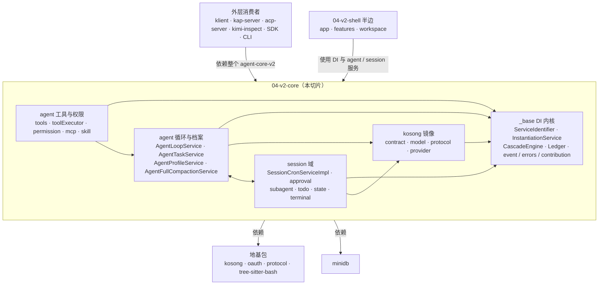

# 04-v2-core：v2 引擎核心半边

本切片是 `packages/agent-core-v2` 的核心半边，由 `agent`、`session`、`kosong` 镜像、`_base` 四个 junction 构成：`_base` 是 DI 内核与生命周期底座，`ServiceIdentifier` 与 `InstantiationService` 是全图连边最多的两个抽象，`CascadeEngine` 以事务方式驱动 provide / unprovide / update，`Ledger` 负责逆序拆除；`kosong` 镜像把 provider 报错、契约类型等 LLM 层语义搬到包内（报告里唯一的 import 环就落在 `kosong/protocol` 的三个文件之间）；`agent` 侧由 `AgentLoopService`、`AgentTaskService`、`AgentProfileService`、`AgentFullCompactionService` 驱动循环、任务、档案与全量压缩；`session` 侧以 `SessionCronServiceImpl` 等服务承载定时、审批、子代理等会话域能力。全图 4922 节点 / 9438 边、259 个 community，`_base` 的 DI、cascade、collection（Community 0 / 8 / 9 / 10 / 22）与 agent / session 的任务、档案、cron 簇（Community 11 / 23 / 24）是主要聚类；这一侧没有 Workspace DI scope，生命周期只有 App / Session / Agent 三级，Workspace 由 App 侧的 `IWorkspaceInstanceManager` 物化为普通对象，不进 DI 树。

## 对外

- **允许依赖的地基**：`kosong`、`oauth`、`protocol`、`tree-sitter-bash`，以及 `minidb`。本侧对外的外部依赖只允许这几条边，不要引入其他包。
- **同包的另一半**：04-v2-shell（`app`、`features`、`workspace`）消费这一侧 —— 用这里的 DI 内核装配单元，用这里的 agent / session 服务跑会话。
- **整包消费者**：klient、kap-server、acp-server、kimi-inspect、SDK、CLI 依赖的是整个 `agent-core-v2` 包（本切片 + 04-v2-shell 合体）。图上只画整包依赖这一条边，不拆成假想的细边。
- **scope 边界**：本侧没有 Workspace DI scope，只有 App / Session / Agent 三级；Workspace 实体由 App 侧管理器以普通对象物化，不注册进 DI 树。
