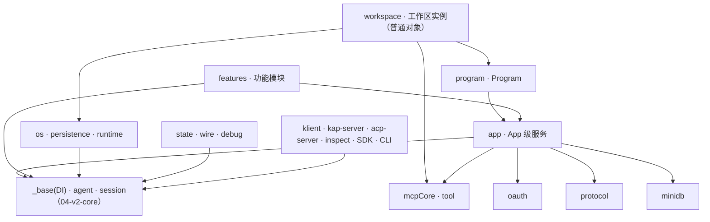

# 04 · v2 外壳（shell）

这一片是 `agent-core-v2` 的外壳半边：`app`、`features`、`workspace`、`program`、`mcpCore`、`os`、`persistence`、`runtime`、`debug`、`state`、`tool`、`wire` 十二个 junction，490 个文件。Import Cycles 检测结果是「一条都没有」。God Nodes 十个里有七个是这一半的：`AgentGoalService`（70 条边，`features/goal/goalService.ts`）、`FileSessionIndex`（37，`app/sessionIndex/`）、`SessionLifecycleService`（36，`workspace/sessionLifecycle/`）、`ConfigService`（33，`app/config/`）、`PluginService`（32，`app/plugin/`）、`OAuthService`（31，`app/auth/authService.ts`）、`TowerStore`（31，`features/tower/protocol/store.ts`），另外三个是 `AgentRunBatch`（33，`features/swarm/session/`）、`McpConnectionManager`（31，`mcpCore/connection-manager.ts`）、`EventDispatcherService`（31，`state/eventDispatcherService.ts`）——复杂度沉在 App 级装配、会话生命周期和 Feature 单元上，没有被摊薄。Surprising Connections 是五处跨 junction 的顺手一调：`workspaceAgentProfileLoader/internal/systemFile.ts` 的 `loadSystemMdProfile()` 直接问 `app/agentProfileCatalog/` 的 `normalizeAgentProfile()` 与 `skillActiveFor()`，`app/auth/configSection.ts` 的 `serviceEntryToToml()` 走 `app/config/toml.ts` 的 `plainObjectToToml()`，`features/tower/tools/mission/missionTool.ts` 的 `renderMission()` 落到 `features/tower/protocol/paths.ts` 的 `missionFileName()`，`app/skillCatalog/builtin/sub-skill.ts` 的 `makeBuiltin()` 调 `app/skillCatalog/parser.ts` 的 `parseSkillText()`。Community 层面切得最碎（225 个，46 个 thin 被省略，cohesion 普遍只有 0.03–0.07）：Community 0 是 `ISessionIndex` 一族的会话列表读模型，Community 3 是 kosong 配置与模型覆写，Community 7 是 DI 单元的 debug 级联，Community 2 是各类 persistence scope 归属辅助。

**没有第四层 Workspace DI scope。** `agent-core-v2` 的 `LifecycleScope` 只有 `App` / `Session` / `Agent` 三层，声明在 `src/app/scopes.ts`；工作区不是 scope，而是 App 级 `IWorkspaceInstanceManager.getOrCreate()` 按 id 或根目录 create-or-get 出来的普通 `WorkspaceInstance` 对象，每个实例持有一个 `Program`，由 `Program` 手工构造当期运行时世代的 workspace 共享服务（`workspaceSkillCatalog` / `workspaceAgentProfileLoader` / `workspaceInstructions` / `workspaceMcp` / `workspaceMcpConfig` / `workspaceDirs` / `workspaceFs` / `workspaceFsWatch` / `workspaceGit` / `workspaceTrust`），运行时世代变了就整体刷新。会话那一侧同理：App 级 `ISessionManager` 解析工作区后，从 `program.createSessionController()` 取 per-workspace 的 `SessionLifecycleService`，工作区投影经 `ScopeOptions.seeds` 在 Session scope 激活前占位（`sessionData()` / `sessionProvider()` / `sessionHandle()` / `sessionInfo()` 的 live view），种子占的是 token，不开新 scope。

## 对外

对外只声明下面这些依赖事实，箭头方向统一为「消费者 → 依赖」：

- **同包 04-v2-core**：`_base` 的 DI 内核、`agent`、`session`。外壳的 App 级服务、会话生命周期、Feature 单元全部建在这三块上。
- **地基**：`oauth`、`protocol`。
- **存储**：`minidb`（`ISessionIndex` 的 query-store 读模型走这里）。
- **不依赖**：v1 的 `agent-core`、`kaos`。

反向的出边只有一条——整个 `agent-core-v2`（core 半边 + 外壳半边合起来）被 `klient`、`kap-server`、`acp-server`、`kimi-inspect`、`kimi-code-sdk` 和 Kimi Code CLI 依赖，本切片自身不对外暴露任何子路径。
