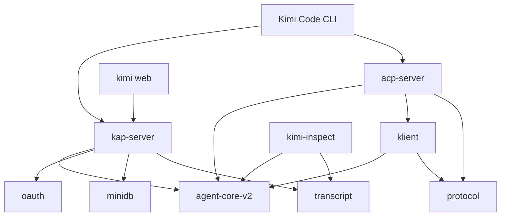

# 05 · v2 外沿（edge）

这一片是坐在 `agent-core-v2` 之上的最外沿：`klient`、`kap-server`、`acp-server`、`kimi-inspect` 四个交汇点，外加把它们拼成产品的 Kimi Code CLI。整个切片 289 个文件、6189 条边，Import Cycles 检测结果是「一条都没有」，边全部朝外——God Nodes 里 `defineRoute()` / `okEnvelope()` / `errEnvelope()` 撑起 kap-server 的路由外壳，`AcpSession` 与 `SessionEventBroadcaster` 撑起 acp-server 的会话与广播，`AgentTranscriptProjector` 把事件投影到 transcript；Surprising Connections 则集中在 `startServer()` 一口气连上 `createInstanceRegistry()`、`createAuthHook()`、`createAuthFailureLimiter()` 的启动装配链上。共同体层面，外沿被切得很碎（134 个 community）：路由 schema 一团（Community 35/102）、ACP 会话一团（17）、广播与 journal 一团（26/72）、klient 的 IPC 通道一团（37/41/70），而跨社区的黏合剂——`useConnection()`、`requestLog()`——正是这些交汇点本身的入口。

## 对外

对外只暴露 package.json 层面的依赖事实，四个交汇点各司其职：

- **`klient`**：依赖 `agent-core-v2` 和 `protocol`，是契约驱动的客户端门面。
- **`kap-server`**：依赖 `agent-core-v2`、`oauth`、`minidb`、`transcript`，是 REST + WebSocket 服务端。
- **`acp-server`**：依赖 `agent-core-v2`、`klient`、`protocol`，经 klient 反问引擎。
- **`kimi-inspect`**：依赖 `agent-core-v2`、`transcript`，是调试检查器。
- **Kimi Code CLI**：依赖 `kap-server` 和 `acp-server`。
- **kimi web**：永远走 `kap-server`，不直连其他任何包。
