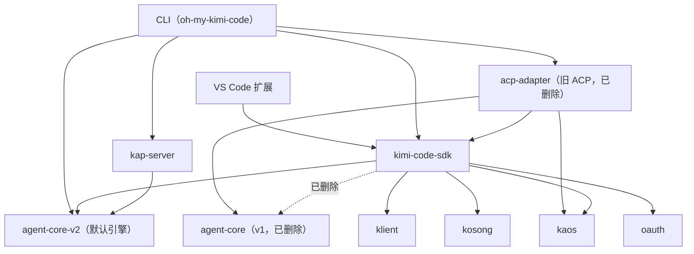

# 06 · 宿主层（原双引擎结，v1 已删除）

> 历史切片。`agent-core` 与 `acp-adapter` 已删除，本图描述的是删除前的「结」。

删除前 v1 删不掉的根子在 SDK：它是所有入口的公共底座，依赖里同时挂着两个引擎；只要 SDK 公开 API 还引用 v1 符号，CLI 和 VS Code 扩展就一并被拴住。旧 ACP `acp-adapter` 也直接依赖 v1。报告的 God Nodes 里 `SDKRpcClientBase`（127 条边）与 `SDKRpcClientV2`（156 条边）并列，也从侧面印证两代 RPC 通道都还活着 —— v1 不是残留，而是仍在服役的回退轨。

## 内部图

## 对外

- **`kimi-code-sdk`**：同时依赖 `agent-core`（v1）和 `agent-core-v2`，还依赖 `kaos`、`oauth`、`klient`、`kosong`。这是 v1 暂时无法下线的直接原因。
- **`acp-adapter`**（旧 ACP）：依赖 `agent-core`、`kaos`、`kimi-code-sdk`。`acp-server` 是 v2 ACP，不进上面的内部图；对外只需记住 CLI 同时挂了新旧两个 ACP。
- **CLI（`oh-my-kimi-code`）**：依赖 `acp-adapter`、`acp-server`、`agent-core-v2`、`kap-server`、`kimi-code-sdk`、`oauth`、`telemetry`、`migration-legacy`、`minidb`、`pi-tui`、`vis-server`。
- **VS Code 扩展**：依赖 `kimi-code-sdk` 和 `migration-legacy`。
- **引擎选择**：默认引擎是 v2；只有 `KIMI_CODE_LEGACY_FLAG` 才回 v1。kimi web 不看这个开关，直接走 `kap-server`。
